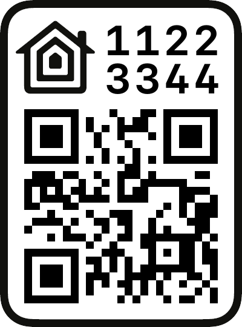
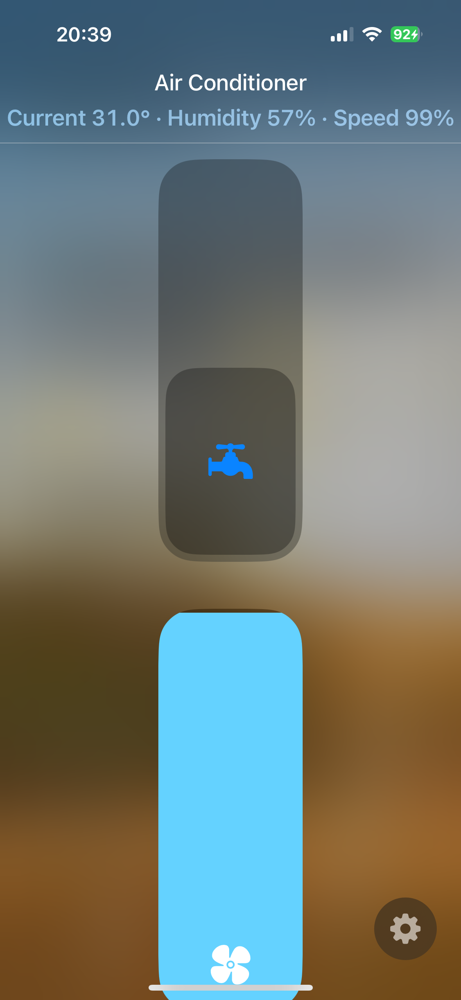
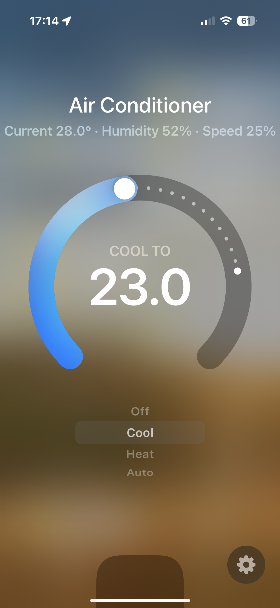
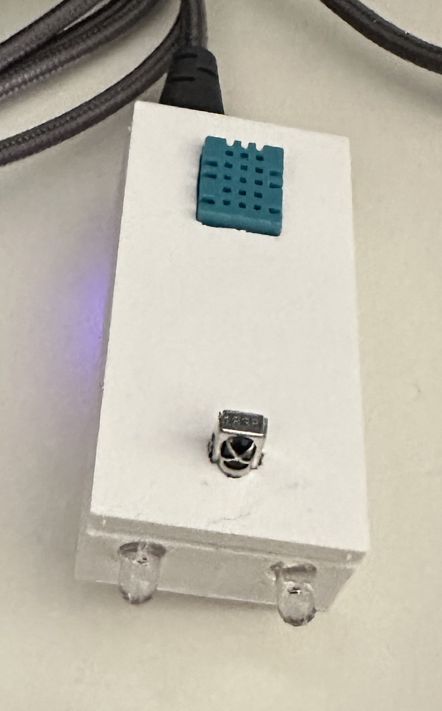

# ESP32 Air Conditioner Controller

This project provides an ESP32-based air conditioner controller that communicates via infrared signals. It features a web interface for managing the IR protocols and drying settings, and it integrates with Apple HomeKit for smart home automation.

## Features

- **IR Protocol Management:** Detect and manage infrared protocols for controlling the AC unit.
- **Drying Before Shutdown:** A fan-only mode to dry the AC system before powering off.
- **Apple HomeKit Integration:** Control the AC through HomeKit.
- **Web Interface:** Change settings via a local web server.


## Hardware

Before building and flashing the controller, make sure you have the following:

- ESP32-S3 Development Board
- DHT11/22 Temperature Sensor
- IR Transmitter and Receiver
- 2N3904 NPN Transistor
- 2.2uF Capacitor
- 1kΩ resistor
- Arduino IDE or PlatformIO
- Apple HomeKit Setup


---

## Building the Controller

### Circuit Diagram

Below are the three diagrams for connecting the infrared receiver, infrared transmitter, and temperature sensor.

1. **IR Transmitter:**
   - Connect the IR LED to the ESP32 `GPIO 4`.
   - Use a **2N3904 transistor** to drive the IR LED without the need for a resistor.


2. **IR Receiver:**
   - Connect the IR receiver to `GPIO 15`.
   - Use a **2.2uF capacitor** to stabilize the signal.


3. **DHT11/22 Temperature Sensor:**
   - Connect the data pin of the DHT11 sensor to `GPIO 16`.
   - Use a 1kΩ pull-up resistor on the data pin.


### Ensure all components are powered by the 3.3V and GND pins of the ESP32.


---

## Flashing the ESP32

1. **Clone the Repository:**
   ```bash
   git clone <repository-url>
   cd <repository-folder>

Install Dependencies: Install the necessary libraries (IRremoteESP8266, HomeSpan, etc.) in your Arduino IDE or PlatformIO.

Upload the Code:

In Arduino IDE: Select the ESP32 board and the correct port, then click "Upload".
In PlatformIO: Run the command pio run --target upload.

---

## Configuring the Wireless Network
After flashing the code to the controller, follow these steps to configure the controller for your home wireless network:

Open the Wi-Fi settings on your phone or computer.
Connect to the network named ESP32 Ac Controller with the password 123456789.
Once connected, the settings interface will automatically open in your browser.
On this page, select your home Wi-Fi network and enter the password.
After saving the settings, the controller will reboot and connect to your home network.
Now, the controller is connected to your home network, and you can access the web interface or pair it with Apple HomeKit.

---

## IR Protocol Setup and Synchronization
After setting up the network, follow these steps to configure the controller to recognize the remote control's protocol:

Point the Air Conditioner Remote at the Controller:

Ensure the ESP32 controller is powered on and connected to your home network.
Point the remote control of your air conditioner directly at the controller.
Press the On and Off buttons on the remote control. The controller will detect and save the protocol of your remote.
Maintaining Synchronization with the Remote:

To keep the controller synchronized with the remote control, place the ESP32 controller within the vicinity of the air conditioner.
When controlling the air conditioner with the remote, the controller will pick up the changes and automatically synchronize the HomeKit app with the state of the AC unit.
This ensures that changes made with the remote control are reflected accurately in your HomeKit app, allowing seamless control via both the remote and your smart home system.

---

## Web Interface Setup
Once the code is flashed and the controller is connected to your home network, the ESP32 hosts a local web server for managing the AC controller.

Accessing the Web Interface
Connect to the same Wi-Fi network as the ESP32.
Open your browser and go to 'http://homespan-ac-controller.local'
Web Interface Features:
- Select IR Protocol: Choose the detected protocol for your AC.
- Drying Settings: Set a delay for drying before shutdown.
- Delete Protocols: Clear all detected protocols.

---

## Adding the Controller to the Home Application
To add the controller to the Home app, follow these steps:

- Using the HomeKit QR Code:

Open the Home app on your Apple device.
Tap + Add Accessory, then scan the QR code provided 




- Using the Setup Code:
  
Alternatively, if you don’t have the QR code handy, you can manually enter the setup code.
Tap + Add Accessory and select Don't Have a Code or Can't Scan?.
Enter the following HomeKit code: 112-23-344.
After successfully pairing, you will be able to control your air conditioner via the Home app.

## Homekit

<div style="display: flex; justify-content: space-between;">
    
    
</div>

## Case


## Contributing
Contributions are welcome! Please open an issue or submit a pull request for any improvements or bug fixes.

## License
This project is licensed under the MIT License. See the LICENSE file for details.
