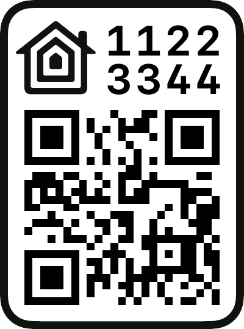
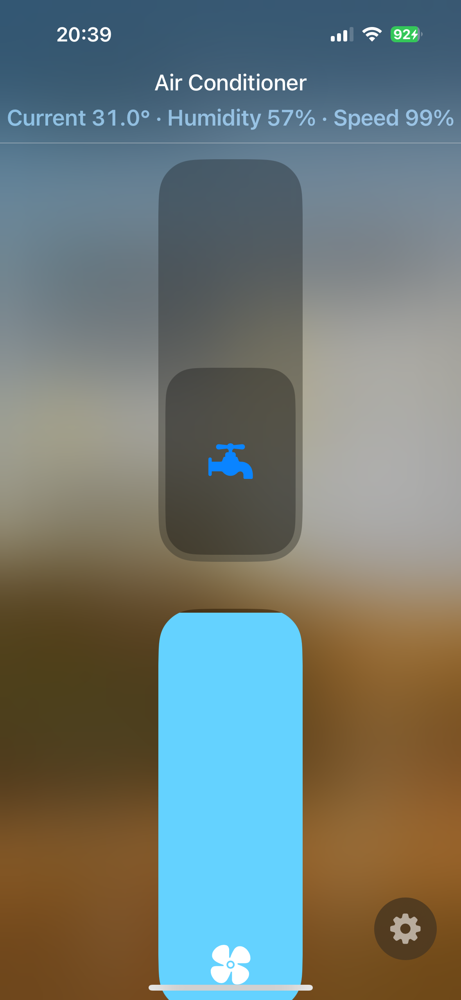
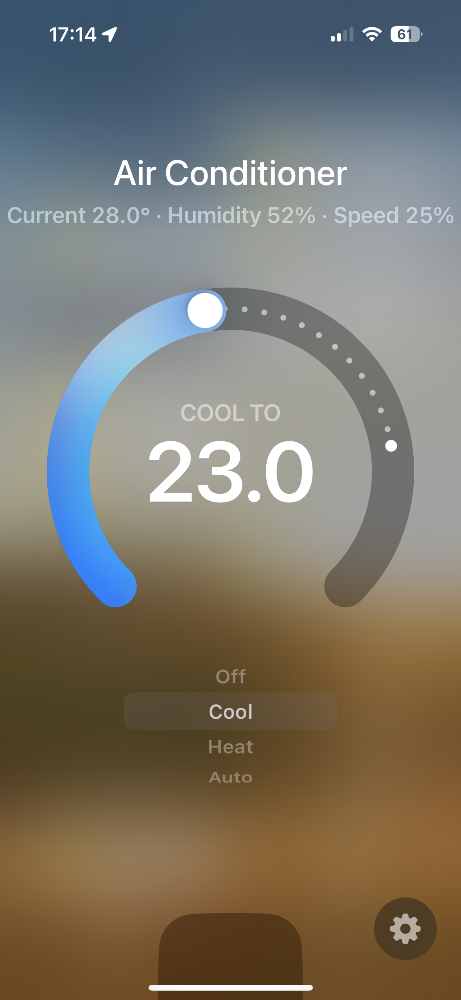
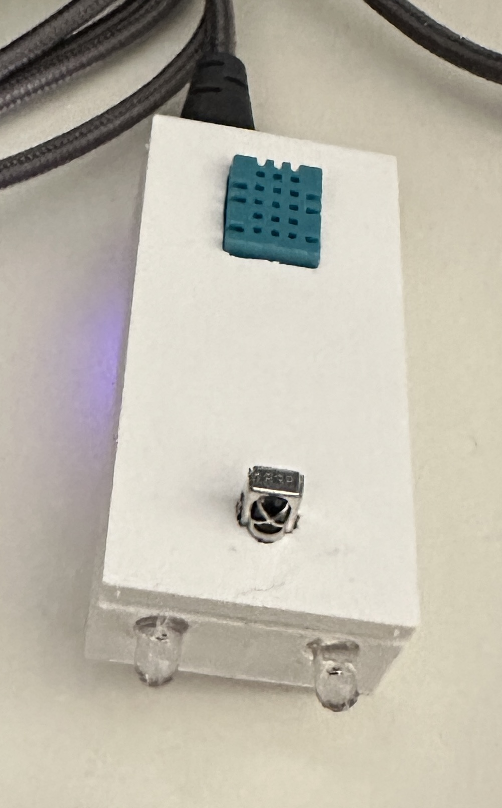

# ESP32 Air Conditioner Controller

ESP32-S3 based air conditioner controller that learns a supported IR air-conditioner protocol, sends IR commands, exposes a local web interface, and integrates with Apple HomeKit through HomeSpan.

## Features

- IR protocol detection and selection
- Apple HomeKit thermostat and fan controls
- Local web interface for protocol and drying-shutdown settings
- Optional fan-only drying period before shutdown
- DHT temperature and humidity reporting

## Hardware

- ESP32-S3 development board
- DHT11 temperature/humidity sensor by default
- IR transmitter and IR receiver
- 2N3904 NPN transistor for driving the IR LED
- Current-limiting resistor for the IR LED circuit
- 2.2 uF capacitor for IR receiver supply filtering
- 1 kOhm pull-up resistor for the DHT data pin

## Pinout

| Part | ESP32-S3 pin |
| --- | --- |
| IR LED transmitter | GPIO 4 |
| IR receiver signal | GPIO 15 |
| DHT data | GPIO 16 |
| HomeSpan status RGB LED | GPIO 48 |

Power all external modules from the ESP32 3.3 V and GND pins unless your specific module requires a different supported supply.

### Circuit Diagrams

1. IR Transmitter

   Connect the IR LED driver to `GPIO 4`. Use the transistor as a driver and include proper current limiting for the IR LED path.


2. IR Receiver

   Connect the IR receiver output to `GPIO 15`. Use the 2.2 uF capacitor across the receiver supply pins to reduce noise.


3. DHT Sensor

   Connect the DHT data pin to `GPIO 16` and use a 1 kOhm pull-up resistor on the data line.


## Build and Flash

### PlatformIO

This repository includes `platformio.ini` for an ESP32-S3-WROOM-1 N16R8 target.

```bash
pio run
pio run --target upload
```

The PlatformIO environment pins HomeSpan to `1.9.1` because the current stable PlatformIO ESP32 Arduino package is based on Arduino-ESP32 2.x. Newer HomeSpan 2.x releases require Arduino-ESP32 3.3.0 or later.

### Arduino IDE

Install these libraries:

- HomeSpan
- IRremoteESP8266
- DHT sensor library by Adafruit
- Adafruit Unified Sensor

For an ESP32-S3-WROOM-1 N16R8 module, use these Arduino IDE board settings:

- Board: `ESP32S3 Dev Module`
- Flash Size: `16MB (128Mb)`
- PSRAM: `OPI PSRAM`
- Partition Scheme: any 16 MB or huge-app option with an app slot larger than 2 MB, such as `16M Flash (3MB APP/9MB FATFS)` or `Huge APP (3MB No OTA/1MB SPIFFS)`
- USB CDC On Boot: match your board's USB/serial wiring

The default partition often gives only about 1.3 MB for the app, which is too small for HomeSpan plus IRremoteESP8266. The sketch defaults to `DHT11`; to use DHT22, change `DHT_TYPE` in `ThermostatAccessory.cpp` or define `DHT_TYPE=DHT22` in your build flags.

## Wi-Fi Setup

After flashing, if no Wi-Fi credentials are stored, HomeSpan starts an access point:

- SSID: `ESP32 Ac Controller`
- Password: `123456789`

Connect to that network from your phone or computer, enter your home Wi-Fi credentials in the captive portal, and let the ESP32 restart.

## IR Protocol Setup

The controller must learn a supported air-conditioner state before it can send commands.

1. Power the ESP32 and connect it to Wi-Fi.
2. Point the original AC remote at the IR receiver.
3. Press a normal AC command such as power, cool, heat, or temperature.
4. The controller stores the first supported protocol and decoded AC state.
5. Open the web interface and select the detected protocol if more than one was captured.

If no supported decoded state has been saved, HomeKit commands are rejected instead of sending invalid IR data.

## Web Interface

Open this address from the same network:

```text
http://homespan-ac-controller.local
```

The web interface can:

- Select the saved IR protocol
- Delete detected protocols and saved AC state
- Enable or disable drying-before-shutdown
- Set the drying delay from 1 to 60 minutes

Changing the drying accessory setting restarts the ESP32 after the HTTP response is sent because the HomeKit accessory database changes.

## Apple Home

Pair in the Home app with the QR code or manual setup code.



Manual setup code:

```text
112-23-344
```

<div style="display: flex; justify-content: space-between;">
    
    
</div>

## Case



## License

This project is licensed under the MIT License. See the LICENSE file for details.
